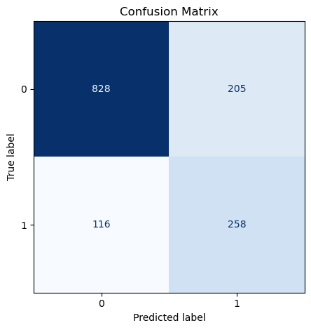
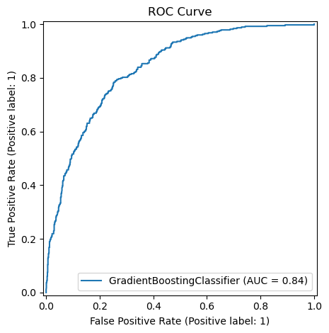
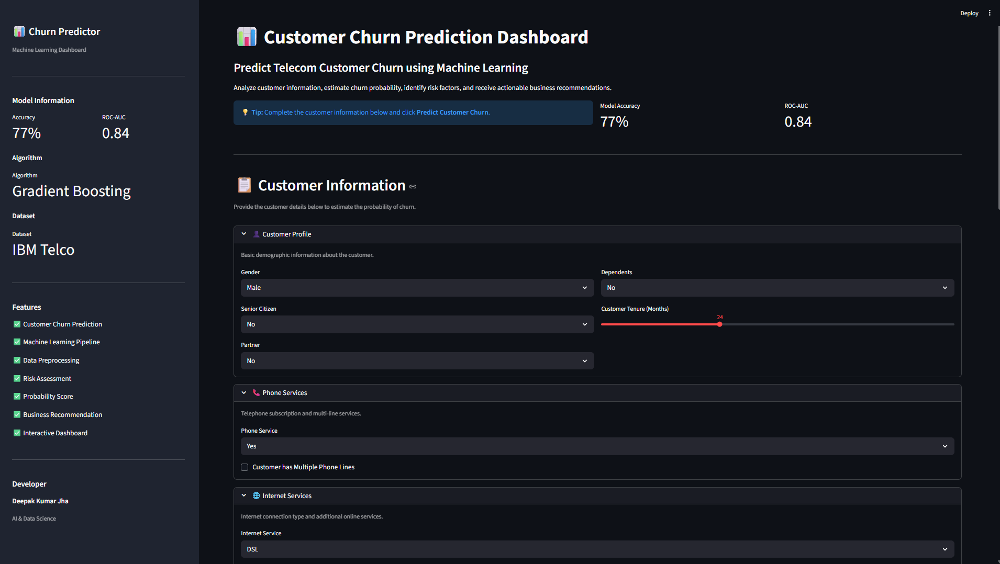
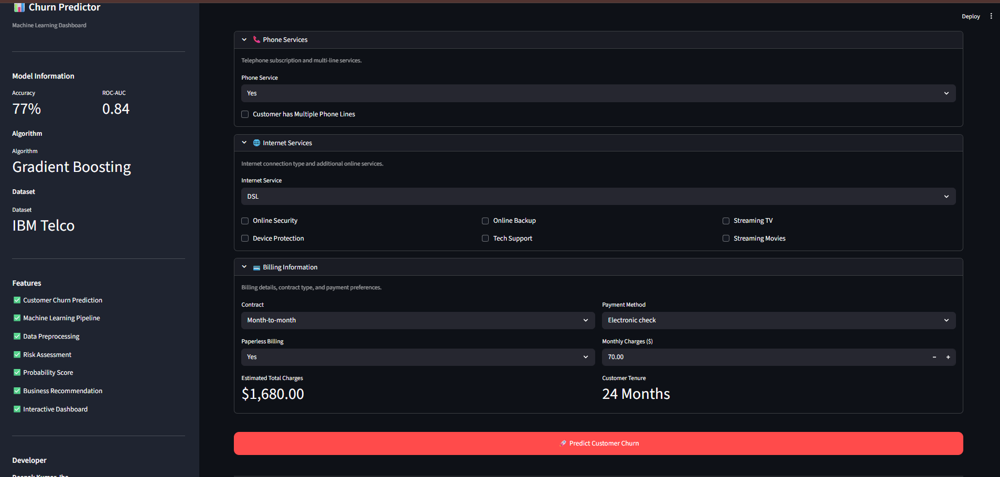
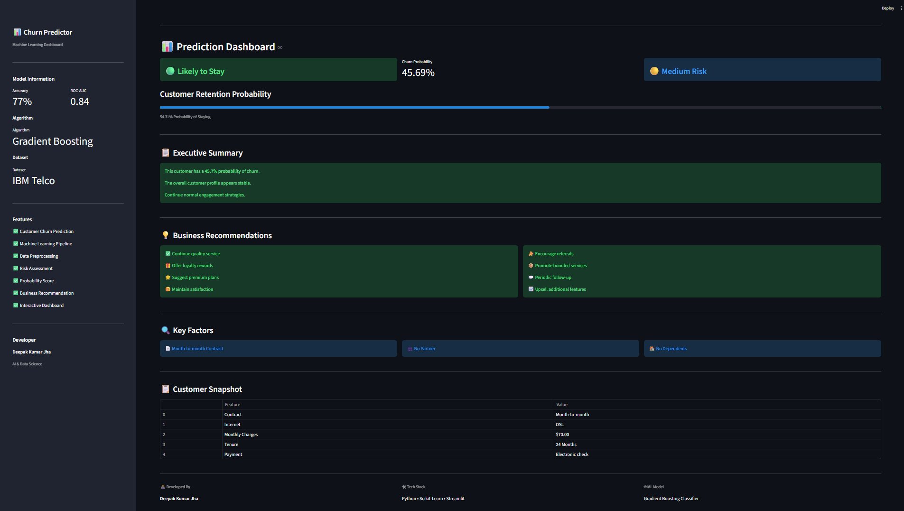

# 📊 Customer Churn Prediction Dashboard

## 🚀 Live Demo

🔗 Try the application here:

https://customer-churn-predictor-vk18.streamlit.app/


---

## 📌 Project Overview

Customer churn is one of the biggest challenges faced by subscription-based businesses.  
This project predicts whether a telecom customer is likely to leave the service using Machine Learning.

The system analyzes customer demographics, account information, subscribed services, and billing details to estimate churn probability and provide actionable business recommendations.

This project follows a complete Data Science workflow:

```
Data Collection
        ↓
Exploratory Data Analysis
        ↓
Data Preprocessing
        ↓
Feature Engineering
        ↓
Handling Class Imbalance
        ↓
Model Training
        ↓
Model Evaluation
        ↓
Interactive Dashboard Deployment
```

---

# 🎯 Problem Statement

Telecom companies lose revenue when customers discontinue services. Identifying customers who are likely to churn allows companies to take preventive actions.

The objective is to build a machine learning solution that:

- Predicts customer churn probability
- Identifies important churn factors
- Provides retention recommendations
- Helps businesses reduce customer loss


---

# 📂 Dataset Information

Dataset Used:

**IBM Telco Customer Churn Dataset**

The dataset contains customer information including:

- Customer demographics
- Account information
- Internet services
- Phone services
- Contract details
- Payment information


### Dataset Details

| Attribute | Information |
|-|-|
| Total Records | 7043 Customers |
| Target Variable | Churn |
| Problem Type | Binary Classification |
| Classes | Yes / No |


---

# 🛠️ Technologies Used

## Programming Language
- Python


## Libraries

- Pandas
- NumPy
- Matplotlib
- Seaborn
- Scikit-Learn
- Imbalanced Learn (SMOTE)
- Joblib


## Application

- Streamlit


## Development Tools

- VS Code
- Jupyter Notebook
- Git & GitHub


---

# 📁 Project Structure


```
Customer-Churn-Prediction/

│
├── app/
│   ├── app.py
│   ├── utils.py
│
├── data/
│   └── raw/
│       └── Telco-Customer-Churn.csv
│
├── models/
│   ├── gradient_boosting_model.pkl
│   └── preprocessor.pkl
│
├── notebooks/
│   ├── 01_data_understanding.ipynb
│   ├── 02_eda.ipynb
│   ├── 03_preprocessing.ipynb
│   └── 04_model_training.ipynb
│
├── reports/
│   └── figures/
│
├── src/
│   ├── preprocessing.py
│   ├── feature_engineering.py
│   ├── train.py
│   ├── evaluate.py
│   ├── predict.py
│   └── pipeline.py
│
├── requirements.txt
├── README.md
├── LICENSE
└── .gitignore
```


---

# 🔍 Exploratory Data Analysis

Performed detailed analysis including:

✔ Churn distribution  
✔ Gender based analysis  
✔ Contract impact  
✔ Internet service effect  
✔ Monthly charges analysis  
✔ Tenure relationship  
✔ Payment method analysis  


---

# ⚙️ Data Preprocessing

Steps performed:

### Missing Value Handling

- Removed invalid records
- Converted incorrect data types
- Fixed missing TotalCharges values


### Feature Transformation

Applied:

- One Hot Encoding
- Feature Scaling


### Class Imbalance Handling

The dataset was imbalanced.

Used:

```
SMOTE
(Synthetic Minority Oversampling Technique)
```

Before SMOTE:

```
No Churn > Churn
```

After SMOTE:

```
No Churn = Churn
```

---

# 🤖 Machine Learning Models


Multiple algorithms were trained:


| Model |
|-|
| Logistic Regression |
| Decision Tree |
| Random Forest |
| Gradient Boosting |
| Histogram Gradient Boosting |


After evaluation:

## 🏆 Best Model Selected

```
Gradient Boosting Classifier
```

---

# 📈 Model Performance


| Metric | Score |
|-|-|
| Accuracy | 77% |
| ROC-AUC Score | 0.84 |
| Precision | 0.56 |
| Recall | 0.69 |
| F1 Score | 0.62 |


---

# 📊 Evaluation Results


## Confusion Matrix




---

## ROC Curve




---

# 💻 Streamlit Dashboard


The project includes a complete interactive dashboard.

Features:

✔ Customer information input  
✔ Real-time churn prediction  
✔ Churn probability score  
✔ Customer risk category  
✔ Business recommendations  
✔ Important churn factors  
✔ Customer summary report  


---

## Dashboard Preview






---

## Prediction Result





---

# 🚀 Installation & Usage


## 1. Clone Repository


```bash
git clone https://github.com/YOUR_USERNAME/Customer-Churn-Prediction.git
```


Navigate:

```bash
cd Customer-Churn-Prediction
```


---

## 2. Create Virtual Environment


```bash
python -m venv .venv
```


Activate:

Windows:

```bash
.venv\Scripts\activate
```


Linux/Mac:

```bash
source .venv/bin/activate
```


---

## 3. Install Dependencies


```bash
pip install -r requirements.txt
```


---

## 4. Run Application


```bash
streamlit run app/app.py
```


---

## 🌐 Deployment

The application is deployed using Streamlit Cloud.

Deployment workflow:

1. Source code pushed to GitHub
2. Streamlit Cloud connected with repository
3. Python environment configured
4. Dependencies installed from requirements.txt
5. Application served using Streamlit


# 📌 Key Features


✅ Complete Machine Learning Pipeline

✅ Professional Streamlit Dashboard

✅ Data Cleaning & Feature Engineering

✅ Multiple Model Comparison

✅ SMOTE Class Balancing

✅ Probability Based Prediction

✅ Risk Level Classification

✅ Business Recommendation System

✅ Interactive User Interface


---

# 🔮 Future Improvements


- Deploy application online
- Add database support
- Add customer analytics dashboard
- Improve model accuracy
- Add Explainable AI using SHAP


---

# 👨‍💻 Developer


**Deepak Kumar Jha**

AI & Data Science Enthusiast

Skills:
- Machine Learning
- Data Science
- Python Development


---

# ⭐ Support

If you found this project useful, consider giving it a ⭐ on GitHub.

```
Made with ❤️ using Python and Machine Learning
```
